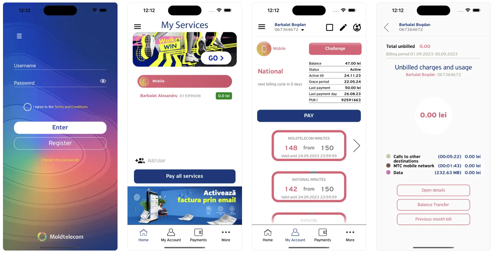
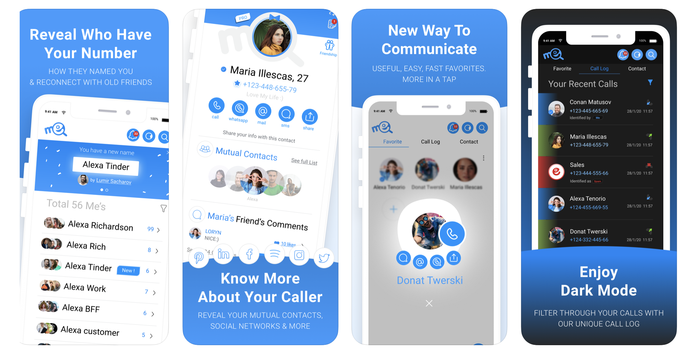
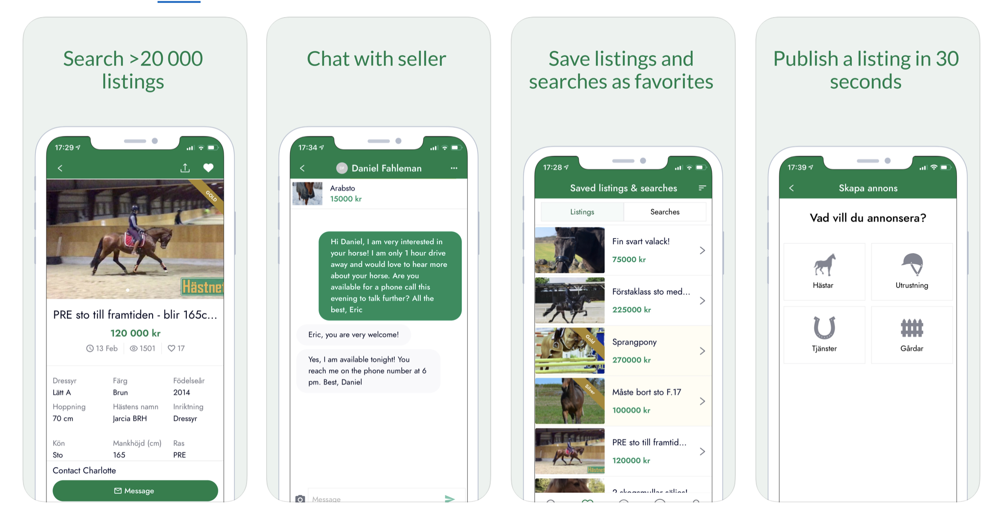

# Langly
[Langly: Oxford English Lessons](https://apps.apple.com/us/app/langly-oxford-english-lessons/id1590108463)
Learn English language fun and effective!

Follow the story, solve the mystery, learn the theory & play games to learn English with Langly - a free educational app.

# MyMoldtelecom
[MyMoldtelecom](https://apps.apple.com/us/app/mymoldtelecom/id1260879758) is an app that allows users to manage their subscription plans (Mobile Telephony Unite/Fixed Telephony/IPTV) for Moldtelecom - one of the biggest telecom company in Moldova.

• Check your account balance, Internet traffic, available minutes
• View rate plans
• Track current and monthy expenses
• Download detailed information about your calls and get the last invoice
• Activate options and additional services
• Manage user services
• View closest Moldtelecom store address on a map

# Me 

[Me](https://apps.apple.com/us/app/me-caller-id/id936601391) smart caller ID with Call and SMS Spam protection.                                                                                              

Main features:

• Contacts back-up and restore.                                                                                              
• Real-time identify and block spam calls and sms. User based or automatically by app. Block unwanted callers and SMS using iOS Extensions.                                                                                                                                                                                            
• Profiles with all the user data and social network accounts.                                                                                              
• Location sharing between accounts.                                                                                              
• RTL and LTR support. Localizations in multiple languages.                                                                                              
• Full dark-mode support.                                                                                                                                                                                            
• Tips and guides throughout the app.                                                                                              

# Hastnet 
[Hastnet](https://apps.apple.com/us/app/hastnet/id1451949900) is Europe's largest marketplace for horses and all things related to horses

